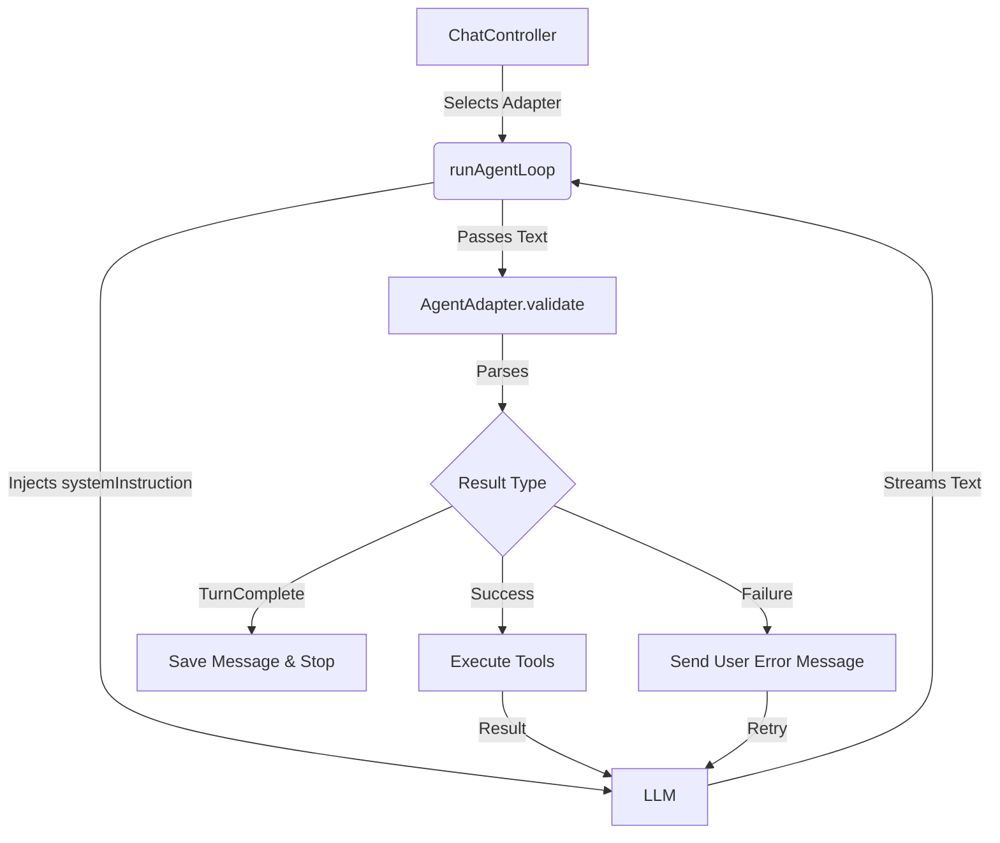

# Agent Adapter Architecture

The **Agent Adapter** pattern decouples the "Brain" of the agent (how it is instructed and how it signals intent) from the "Body" (the execution loop, state management, and tool execution).

This allows `Decamp` to support multiple different prompting strategies (e.g., Bash Code Blocks, Native Function Calling, XML Tags) without changing the core application logic.

## Core Concepts

### 1. AgentAdapter (`agent_adapter.dart`)

The `AgentAdapter` is the interface that defines a specific agent strategy. It is responsible for:

*   **Identity**: Name and description of the strategy.
*   **Instruction**: Providing the `systemInstruction` that teaches the LLM how to behave and how to call tools.
*   **Tools**: Defining which native tools (if any) are exposed to the LLM.
*   **Validation**: Parsing the LLM's text output to extract tool calls, detect completion, or identify protocol violations (stalling).

### 2. AdapterResult

The `validate()` method returns an `AdapterResult`, which dictates the next step in the `runAgentLoop`:

*   **`AdapterSuccess`**: The agent successfully requested tool execution. Contains the parsed `List<ToolCall>`.
*   **`AdapterTurnComplete`**: The agent finished its task or asked a question. Contains the final text content.
*   **`AdapterFailure`**: The agent violated the protocol (e.g., output text without a command). This triggers a "User Correction" message to force the agent to retry.

## Data Flow



## How to Add a New Adapter

To add a new strategy (e.g., XML Tool Calling), create a new class that implements `AgentAdapter`.

```dart
class XmlAgentAdapter implements AgentAdapter {
  @override
  String get id => 'xml_mode';

  @override
  // define your <tool> specs here
  String get systemInstruction => '...'; 

  @override
  AdapterResult validate(String text, List<ToolCall> nativeCalls) {
    // 1. Parse XML from text
    // 2. Return AdapterSuccess(parsedCalls)
    // 3. Or return AdapterTurnComplete / AdapterFailure
  }
}
```

## Current Implementations

### BashAgentAdapter (`bash_agent_adapter.dart`)
*   **Strategy**: "Bash-First" / Monofunction.
*   **Prompt**: Instructs the model to write ` ```bash ` code blocks.
*   **Parsing**: Uses `BashBlockParser` to extract code and convert it into synthetic `execute_shell_command` tool calls.
*   **Validation**: Enforces a strict protocol where the model MUST provide a code block, `COMPLETED_TASK`, or `ASK_USER`. Any other output is considered "stalling" and rejected.